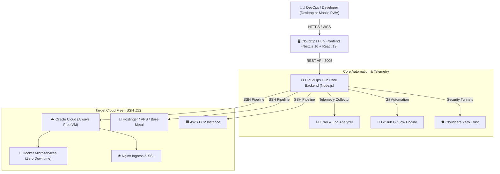

# 🚀 CloudOps Hub — Self-Hosted Multi-Cloud DevOps Control Plane

<p align="center">
  
  
  
  
  
  
  
</p>

<p align="center">
  <b>A lightweight, high-performance, open-source web console for multi-cloud infrastructure orchestration, real-time Docker management, automated CI/CD deployments, and telemetry error tracking without vendor lock-in.</b>
</p>

---

## ⚡ Overview

**CloudOps Hub** replaces bulky, fragmented enterprise tools with a unified, responsive developer console built for indie hackers, DevOps engineers, and agile teams. Manage cloud VMs (Oracle Cloud Infrastructure, Hostinger, AWS, or bare-metal VPS), monitor containers, inspect production logs, run 1-click zero-downtime deploys, and detect runtime errors with minimal CPU and memory footprint on the host.

Available in English and Portuguese (PT-BR).

---

## ✨ Key Features

* 🌐 **Multi-Cloud & VPS Control:** Seamlessly switch between cloud instances, monitor RAM/CPU/Disk usage, and plan server migrations across providers in 1-click.
* 🚀 **1-Click Zero-Downtime Deployments:** Trigger atomic Git production builds directly over secure SSH without dropping live user connections.
* ⏪ **Instant Rollback:** Revert instantly to the previous stable release hash with a single click if production anomalies occur.
* 🔍 **Real-Time Telemetry & Error Tracking:** Monitor system health, track HTTP 4xx/5xx failures, and inspect stack traces without polling overhead.
* 🐳 **Interactive Docker Orchestrator:** Inspect live container metrics, restart crashed microservices, view filtered stdout/stderr logs, and enforce 50MB log rotation to prevent VM disk saturation.
* 🤖 **Odisseu AI Copilot:** Integrated DevOps AI assistant to troubleshoot errors, analyze telemetry, and guide infrastructure upgrades.
* 🛡️ **Zero Trust & Reverse Proxy:** Configure Cloudflare Tunnels and inspect Nginx reverse proxy mappings with automatic SSL handling.
* 📱 **Instant Alerts:** Real-time push notifications for deployments, container crashes, and background scheduler events.

---

## 🏛️ Architecture



---

## 📁 Repository Structure

```text
├── cloud-ops-hub/             # Frontend Client (Next.js 16, React 19, Tailwind CSS 4, Cyber-Teal UI)
│   ├── app/                   # Next.js App Router and core views
│   ├── components/            # Modular dashboard views (Deploy, Docker, Telemetry, Storage, Tunnels)
│   └── public/                # Static assets, manifests, and icons
│
├── cloud-ops-hub-backend/     # Automation & Telemetry Engine
│   ├── src/                   # Server, deploy pipelines, SSH adapters, and log parsers
│   └── database/              # Telemetry logs, deploy audit trails, and server registries
│
└── documentacoes/             # Step-by-step architecture, guide, and operational manuals
```

---

## 🚀 Quick Start (Local Setup)

### 1. Prerequisites
* **Node.js**: v18.0.0 or higher
* **npm** or **pnpm** installed
* **Git** installed

### 2. Clone Repository
```bash
git clone https://github.com/ViniScooper/CloudOps_Hub.git
cd CloudOps_Hub
```

### 3. Start Backend Service
```bash
cd cloud-ops-hub-backend
npm install
node src/server.js
# API running on http://localhost:3005
```

### 4. Start Frontend Console
```bash
cd ../cloud-ops-hub
npm install
npm run dev
# Dashboard running on http://localhost:3000
```

---

## 🔒 Security & Privacy

* **Zero-Knowledge Credentials:** Private SSH keys (`.key` / `.pem`), API tokens, and production secrets are never committed to git. All sensitive parameters are injected strictly via local environment variables (`.env`).
* **Self-Hosted:** Your data stays entirely on your own servers. Telemetry and deployment logs are stored locally in your instance.

---

## 🇧🇷 Sobre o Projeto (Resumo em Português)

O **CloudOps Hub** é uma plataforma open-source brasileira de gerenciamento unificado de infraestrutura em nuvem e containers Docker. Criado para oferecer aos desenvolvedores e pequenas equipes a mesma agilidade de ferramentas corporativas (Portainer, Coolify, Datadog), porém com baixíssimo consumo de memória e foco em custo zero (compatível com máquinas Always Free da Oracle Cloud, Hostinger e AWS).

---

## 🤝 Contributing

Contributions, issues, and feature requests are welcome!
Feel free to check the [issues page](https://github.com/ViniScooper/CloudOps_Hub/issues).

1. Fork the Project
2. Create your Feature Branch (`git checkout -b feature/AmazingFeature`)
3. Commit your Changes (`git commit -m 'feat: Add AmazingFeature'`)
4. Push to the Branch (`git push origin feature/AmazingFeature`)
5. Open a Pull Request

---

## 📄 License

Distributed under the **MIT License**. See [`LICENSE`](./LICENSE) for more information.

Developed with ❤️ by [Vinicius Lourenço](https://github.com/ViniScooper).
