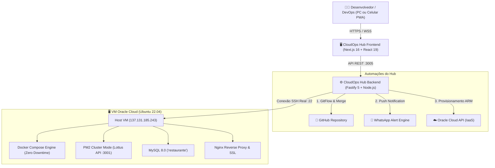

# 🚀 CloudOps Hub — Unified Cloud & Server Management Platform

<p align="center">
  
  
  
  
  
  
  
</p>

> **CloudOps Hub** é uma plataforma moderna, leve e responsiva (PWA) de gerenciamento unificado de servidores Linux e infraestrutura em nuvem (**Oracle Cloud Infrastructure - OCI**, AWS, VPS). Desenvolvida para substituir ferramentas pesadas e fragmentadas (como Portainer, Grafana e MobaXterm) com consumo mínimo de recursos na máquina virtual.

---

## ✨ Principais Funcionalidades

* 🚀 **Deploy Contínuo 1-Click com Zero Downtime:** Atualize o código de produção direto do Git via SSH real, recompilando imagens Docker sem interromper requisições ativas.
* ⏪ **Rollback de Emergência em 1-Clique:** Reversão instantânea para a versão estável anterior em segundos caso ocorra algum imprevisto em produção.
* 🔀 **Automação de Pull Request & GitFlow:** Mesclagem automática entre branches (`develop` ➔ `main` ou `hotfix` ➔ `main`) sem sair do painel e sem abrir o site do GitHub.
* 📜 **Histórico & Auditoria de Deploys:** Rastreabilidade completa com data/hora, autor, hash do commit e tempo de execução.
* 🐳 **Gerenciador Visual de Docker & Logs:** Inicie, pare, reinicie containers e inspecione logs com diagnóstico inteligente de falhas.
* 🛡️ **Blindagem de Disco (50 MB Log Rotation):** Prevenção ativa contra estouro de disco da VM limitando o acúmulo de logs do daemon Docker.
* 🤖 **Robô de Auto-Provisionamento OCI:** Script em background que contorna o erro *"Out of host capacity"* na Oracle Cloud, testando perfis ARM e disparando alerta no WhatsApp assim que liberar vaga gratuita.
* 📱 **Notificações em Tempo Real no WhatsApp:** Alertas automáticos a cada deploy, rollback, merge ou provisionamento de nova máquina.
* 🌐 **Nginx Proxy & Túneis Cloudflare Zero Trust:** Mapeamento visual de domínios com certificados SSL Let's Encrypt.

---

## 🏛️ Arquitetura do Sistema



---

## 📁 Estrutura do Repositório

```text
├── AI_CONTEXT.md              # Documento mestre de contexto para IAs e novos agentes
├── cloud-ops-hub/             # Frontend Web (Next.js 16, React 19, Tailwind CSS 4, PWA)
│   ├── app/                   # App Router e páginas principais
│   ├── components/            # Componentes visuais (DeployView, Logs, Terminal, Metrics)
│   └── public/                # Ícones e assets estáticos
│
├── cloud-ops-hub-backend/     # Backend de Automação (Fastify, SSH2, OCI API)
│   ├── src/
│   │   ├── server.js          # Servidor HTTP e endpoints REST
│   │   ├── deployService.js   # Pipeline de deploy real SSH, rollback e auditoria
│   │   ├── githubService.js   # Automação de Pull Requests e merge GitFlow
│   │   └── oracleScraper.js   # Robô de auto-provisionamento OCI com WhatsApp
│   └── database/              # Histórico persistente de deploys em JSON
│
└── documentacoes/             # Manuais técnicos detalhados passo a passo
    ├── 00_INDICE_GERAL.md
    ├── 01_ARQUITETURA_E_INFRAESTRUTURA.md
    ├── 02_GITFLOW_BRANCHES_E_PULL_REQUEST.md
    ├── 03_DEPLOY_CONTINUO_ZERO_DOWNTIME.md
    ├── 04_GERENCIAMENTO_DOCKER_E_LOGS.md
    ├── 05_ROBO_PROVISIONAMENTO_ORACLE.md
    └── 06_GUIA_RAPIDO_DO_DIA_A_DIA.md
```

---

## ⚡ Como Executar Localmente

### 1. Pré-requisitos
* Node.js v18+ instalado
* Git instalado
* Gerenciador de pacotes `pnpm` ou `npm`

### 2. Configurar o Backend
```bash
cd cloud-ops-hub-backend
cp .env.example .env
npm install
node src/server.js
# Backend ativo na porta 3005 (http://localhost:3005)
```

### 3. Configurar o Frontend
```bash
cd ../cloud-ops-hub
pnpm install
pnpm dev
# Painel disponível em: http://localhost:3000
```

---

## 🔒 Segurança

Por motivos de proteção da infraestrutura, nenhuma credencial sensível, chave privada SSH (`.key`/`.pem`) ou senha de banco de dados é versionada neste repositório público. Todas as variáveis sensíveis são injetadas exclusivamente em tempo de execução através do arquivo `.env`.

---

## 📄 Licença

Distribuído sob a licença **MIT**. Veja `LICENSE` para mais detalhes.

Desenvolvido com foco em alta performance e simplicidade operacional por **Vinicius Lourenço**.
