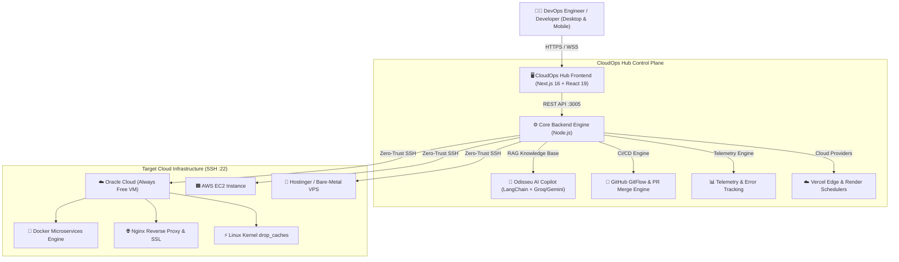

# 🚀 CloudOps Hub — Self-Hosted Multi-Cloud DevOps Control Plane

<p align="center">
  <a href="./LICENSE"></a>
  
  
  
  
  
  
  
</p>

<p align="center">
  <b>A lightweight, high-performance, open-source web console for multi-cloud infrastructure orchestration, real-time Docker management, automated CI/CD deployments, AI-driven DevOps assistance (Odisseu AI), and telemetry error tracking without vendor lock-in.</b>
</p>

<p align="center">
  🌐 <b>Production Web Console:</b> <a href="https://cloudops-hub-dun.vercel.app/" target="_blank">https://cloudops-hub-dun.vercel.app/</a>
</p>

---

## ⚡ Overview

**CloudOps Hub** replaces bulky, expensive, and fragmented enterprise tools (Portainer, Coolify, Datadog) with a unified, ultra-responsive developer command plane built for indie hackers, DevOps engineers, and agile software teams.

Manage cloud VMs (**Oracle Cloud Infrastructure**, **Hostinger**, **AWS EC2**, or bare-metal VPS), monitor containers, inspect production logs, trigger automated 1-click CI/CD GitFlow deployments with instant rollbacks, and consult **Odisseu AI** (an autonomous DevOps copilot backed by LangChain RAG) with a host memory footprint of **less than 50 MB RAM**.

Available in English and Portuguese (PT-BR).

---

## ✨ Key Features & New Capabilities

### 🚀 1. Continuous Deployment & GitFlow Automation (SSH-Driven)
* **1-Click Pull Request & Branch Merging:** Merge `develop` or `hotfix` branches directly into `main` with a single click without opening the GitHub web portal.
* **1-Click Zero-Downtime Deploy:** Connects securely over SSH to trigger atomic Git pulls, dependency installations, and container/process reloads.
* **Instant 1-Click Rollback:** If a deployment fails or causes production regressions, roll back to the previous stable release commit with one click.
* **Live Deployment Streaming Console:** Stream physical bash pipeline outputs and build steps in real time directly inside the browser.
* **Comprehensive Audit Trail:** Full logging of every deploy and rollback (timestamp, project name, branch, commit hash, commit message, author, duration, and status).
* **Git Auto-Configuration:** Automatically set up Git, Deploy Keys, and clone new repositories from GitHub directly into any target VM.

### ☁️ 2. Multi-Cloud Migration Workspace (Zero-Downtime • 1-Click)
* **Real-Time Stack Detection:** Automatically discovers what is actually running on your connected VM (Docker microservices, MySQL 8.0, Object Storage, Nginx, or systemd services).
* **Clean State Intelligence:** Fresh or virginal VMs report zero active projects cleanly, eliminating misleading mock data.
* **1-Click Multi-Cloud Migration:** Automated cutover between Oracle Cloud (OCI), AWS EC2, and VPS providers (Hostinger, Hetzner, DigitalOcean) with automated Terraform script generation.

### 🤖 3. Odisseu AI — Autonomous DevOps & SRE Copilot
* **LangChain RAG Architecture:** Retrieval-Augmented Generation indexed on your live infrastructure state, hardware metrics, container status, and telemetry.
* **Multi-Provider LLM Engine:** Native support for Groq Cloud (GPT-120B / Llama 3.3 70B), Google Gemini, and local Ollama runtimes.
* **Hardware & Quota Diagnostics:** Real-time token quota tracking, CPU/RAM thresholds, swap memory monitoring, and port collision analysis.
* **Interactive Troubleshooting:** Ask questions like *"O que está rodando na VM?"*, *"Como otimizar a memória?"*, or *"Analise os erros dos últimos 15 minutos"*.

### ⚡ 4. Real-Time Telemetry & Hardware Optimization
* **Live Hardware Metrics:** Real-time CPU usage, Memory (used/total), Disk NVMe, and SSH port 22 connectivity status.
* **1-Click RAM Cache Purge (`drop_caches`):** Safely release inactive Linux kernel page caches, dentries, and inodes without restarting containers or interrupting active connections.
* **Zero Overhead:** Metrics are gathered on-demand via lightweight SSH commands rather than heavy persistent background daemons.

### 🌐 5. Vercel & Render Cloud Integrations
* **Vercel Edge & Frontend:** Real-time visibility into production edge builds, domains, commit references, and deployment status.
* **Render Backend & Anti-Sleep Heartbeats:** Monitor backend microservices on Render and configure automated cron heartbeats to prevent free-tier instances from going to sleep.

### 🐳 6. Visual Docker Orchestration & Disk Guard
* **Container Management:** Inspect all running and stopped containers, view CPU/RAM consumption per microservice, and restart individual services.
* **Automatic Log Rotation (`max-size: 10m`):** 1-click Docker daemon log configuration to prevent disk exhaustion from unmanaged container stdout/stderr.

### 💻 7. Interactive Zero-Trust Web SSH Terminal
* **In-Browser Terminal (Bash):** Direct interactive session over SSH with xterm.js styling.
* **DevOps Shortcuts:** 1-click execution for everyday diagnostics: `docker ps`, `free -m`, `df -h /`, `uptime`, `top (CPU)`, and `netstat -tuln`.

### 🪣 8. Object Storage & Database Backups
* **Cloud Storage Explorer:** Direct integration with Oracle Cloud Object Storage and AWS S3 buckets.
* **Automated Database Snapshots:** Trigger snapshot routines and backup dumps for MySQL 8.0 and PostgreSQL databases.

### 📱 9. Full Responsive Experience (Mobile, Tablet & Desktop)
* **Desktop Command Center (>960px):** Spacious, persistent navigation with dedicated workspace views, proportional multi-column grids, and zero layout shift.
* **Mobile & Tablet PWA (<960px):** Slide-out drawer navigation, touch-friendly scrollable tables, and compact metric cards.

### 🔒 10. Enterprise-Grade Security
* **Zero-Knowledge Credential Storage:** SSH keys and API tokens are encrypted locally with AES-256 and stored in memory or client local vault.
* **Clean Incognito Authentication:** Session management backed by JWT and clean input handling without pre-filled test credentials.
* **Zero Vendor Lock-In:** 100% open-source codebase with standard POSIX SSH and Docker commands.

---

## 🏛️ System Architecture



---

## 📁 Repository Structure

```text
├── cloud-ops-hub/             # Frontend Client (Next.js 16, React 19, Tailwind CSS 4, Cyber-Teal UI)
│   ├── app/                   # App Router views (layout, page, login, global styling)
│   ├── components/            # Modular dashboard views:
│   │   ├── DashboardView.tsx         # Real-time infrastructure & nodes
│   │   ├── DeployView.tsx            # CI/CD pipelines, GitFlow PR & instant rollback
│   │   ├── OdisseuChatView.tsx       # AI Copilot with RAG telemetry context
│   │   ├── MigrationWorkspaceView.tsx# Multi-Cloud migration & stack inspector
│   │   ├── VercelDeploymentsView.tsx # Edge frontend status & deployments
│   │   ├── RenderDeploymentsView.tsx # Backend services & anti-sleep crons
│   │   ├── StorageExplorerView.tsx   # Oracle Object Storage & AWS S3 buckets
│   │   ├── EnvManagerView.tsx        # Secure environment variables manager
│   │   └── HelpView.tsx              # Documentation & quick onboarding
│   └── lib/                   # API clients, auth helpers, and encryption utilities
│
├── cloud-ops-hub-backend/     # Automation & Telemetry Engine
│   ├── src/                   # Server, SSH adapters, deploy pipelines, and AI handlers
│   └── database/              # Telemetry logs, audit trails, and server registries
│
└── documentacoes/             # Architecture diagrams, guides, and manuals
```

---

## 🚀 Quick Start (Local Setup)

### 1. Prerequisites
* **Node.js**: v18.0.0 or higher
* **Git**: v2.30.0 or higher
* **Target Server**: Any Linux VM (Ubuntu, Debian, CentOS) with SSH access

### 2. Clone Repository
```bash
git clone https://github.com/ViniScooper/CloudOps_Hub.git
cd CloudOps_Hub
```

### 3. Start Backend Engine
```bash
cd cloud-ops-hub-backend
npm install
node src/server.js
# Backend API active on http://localhost:3005
```

### 4. Start Frontend Console
```bash
cd ../cloud-ops-hub
npm install
npm run dev
# Dashboard accessible on http://localhost:3000
```

---

## 🔒 Security & Privacy

* **No Hardcoded Credentials:** Private SSH keys, API tokens, and passwords are never tracked in Git.
* **Encrypted Credential Vault:** All sensitive inputs are kept strictly in client-side memory or encrypted local storage via AES-256.
* **Self-Hosted Privacy:** Telemetry and deployment audits are saved locally on your server. No analytical telemetry is transmitted to third parties.

---

## 🇧🇷 Sobre o Projeto (Resumo em Português)

O **CloudOps Hub** é uma plataforma open-source brasileira de console unificado de DevOps, infraestrutura multi-cloud e gerenciamento de containers Docker.

Desenvolvido para oferecer a desenvolvedores solo, startups e equipes ágeis o mesmo nível de controle de soluções corporativas (Portainer, Coolify, Datadog), porém com **consumo de memória ultrabaixo (< 50MB RAM)** e foco em custo zero — rodando perfeitamente em instâncias *Always Free* da **Oracle Cloud**, **Hostinger**, **AWS** ou qualquer VPS Linux.

### Principais Diferenciais:
1. **Deploy Contínuo 1-Clique com Rollback:** Merge de PRs e deploys atômicos via SSH sem derrubar conexões ativas.
2. **Migração Multi-Cloud:** Detecta serviços em execução na VM e gera scripts Terraform para migrar entre provedores em 1 clique.
3. **Copiloto Odisseu AI:** Assistente de DevOps autônomo com LangChain RAG integrado à telemetria real do seu servidor.
4. **Otimização Ativa de Memória:** Botão para liberar cache inativo do kernel Linux (`drop_caches`) instantaneamente.
5. **Monitoramento Integrado:** Suporte a Vercel Frontend, Render Backend (com cron anti-sleep) e Oracle Object Storage.

---

## 🤝 Contributing

Contribuições, correções e sugestões de novas funcionalidades são muito bem-vindas!

1. Fork o Projeto (`https://github.com/ViniScooper/CloudOps_Hub/fork`)
2. Crie uma Branch para sua Feature (`git checkout -b feature/MinhaNovaFeature`)
3. Faça Commit das suas alterações (`git commit -m 'feat: Adiciona MinhaNovaFeature'`)
4. Faça Push para a Branch (`git push origin feature/MinhaNovaFeature`)
5. Abra um Pull Request

---

## 📄 License

Este projeto é distribuído sob a licença **MIT**. Consulte o arquivo [`LICENSE`](./LICENSE) para mais detalhes.

```text
MIT License
Copyright (c) 2026 Vinicius Lourenço
```

Desenvolvido com dedicação por [Vinicius Lourenço](https://github.com/ViniScooper).
