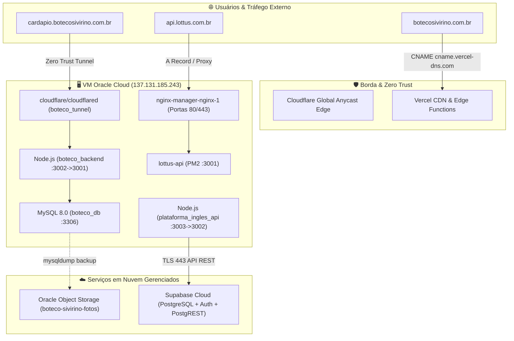

# ☁️ CloudOps Hub — Relatório Completo de Arquitetura, Funcionalidades & Testes

**Data do Documento:** 14 de Setembro de 2026  
**Ambiente:** Produção / VM Oracle Cloud Infrastructure (sa-saopaulo-1)  
**Versão do Sistema:** CloudOps Hub v2.4 (Next.js 16.3 + Fastify 4 + Zero Trust Engine)

---

## 1. Visão Geral da Arquitetura

O **CloudOps Hub** é uma plataforma centralizada de gerenciamento multi-cloud desenhada para monitoramento em tempo real, orquestração de containers Docker, roteamento seguro via Cloudflare Zero Trust e administração de infraestrutura híbrida (Oracle Cloud, Vercel e Supabase).

---

## 2. Mapeamento Detalhado de Funcionalidades

### 2.1. Dashboard Principal (Visão Executiva)
- **Switcher de Servidores:** Troca de contexto entre servidores (`instance-bytedata`, `AWS API Cluster`, `Oracle Staging Sandbox`).
- **Cards de Métricas em Tempo Real:**
  - **CPU Usage:** Monitoramento contínuo de carga dos vCPUs AMD EPYC.
  - **Memória RAM:** Total físico (956 MB), consumo ativo (378 MB) e percentual (39%).
  - **Armazenamento NVMe:** Total (45 GB), usado (15 GB) e percentual (34%).
  - **Status SSH Zero Trust:** Porta 22 monitorada e ativa.
- **Tabela de Recursos & Nós:** Status de cada nó, IP, região e consumo instantâneo.
- **Serviços de Dados & DBA:**
  - Status do MySQL 8.0 (container `boteco_db`).
  - Oracle Cloud Object Storage (bucket `boteco-sivirino-fotos` com 1.4 GB e 142 objetos).
  - Botão **"Gerar Backup Agora"** para disparar `mysqldump` para o bucket.

---

### 2.2. Gerenciador Visual de Docker
- **Listagem e Status:** Todos os containers em execução na VM (`Running`, `Unhealthy`, `Online`).
- **Mapeamento de Portas e Recursos:** Exibe consumo de CPU e RAM por processo.
- **Visualizador de Logs em Tempo Real (Modal):**
  - Botão de inspeção rápida (lupa) para inspecionar `stdout` e `stderr` via `docker logs --tail 60 <container>`.
  - Diagnóstico automatizado com badges visuais (`Healthy` verde / `Unhealthy` vermelho).
  - Ações de **Atualizar Logs** e **Copiar Logs** para a área de transferência.
- **Novo Container:** Modal para criar e subir novos containers via Docker Engine com mapeamento de imagem e portas.

---

### 2.3. Nginx Proxy Reverso & API Gateway
- **Status do Roteador:** Monitoramento do container `nginx-manager-nginx-1` (portas 80 e 443 expostas).
- **Gerenciamento de Hosts:**
  - `cardapio.botecosivirino.com.br` ➔ Encaminha para `http://127.0.0.1:3002` (SSL Let's Encrypt Ativo).
  - `api.lottus.com.br` ➔ Encaminha para `http://127.0.0.1:3001` (SSL Let's Encrypt Ativo).
- **CRUD de Proxy Hosts:**
  - Botão **"Adicionar Host"**: Criação de novas rotas públicas com seleção de SSL.
  - Botão **"Editar"**: Modificação de domínio, porta de destino e certificados com persistência no `localStorage`.

---

### 2.4. Tunnels (Cloudflare Secure & Zero Trust)
- **Proteção de Borda:** Documentação do túnel ativo `boteco_tunnel` (`cloudflare/cloudflared`) eliminando a necessidade de abrir portas no firewall da Oracle Cloud.
- **Mapeamento DNS & Rotas Anycast:**
  - `botecosivirino.com.br`: Apontado para **Vercel** (Edge Functions + CDN global via CNAME `cname.vercel-dns.com`).
  - `cardapio.botecosivirino.com.br`: Roteado via **boteco_tunnel** diretamente para o container Node.js (`boteco_backend`) na porta `:3002`.
  - `api.lottus.com.br`: Roteado via **Nginx Proxy** com terminação SSL para o host local na porta `:3001`.
- **Botão de Sincronização:** Verificação de integridade com a rede global Anycast.

---

### 2.5. Storage (Oracle Cloud Object Storage)
- **Bucket Ativo:** `boteco-sivirino-fotos` na região `sa-saopaulo-1 (GRU)`.
- **Integração Terraform:** Conexão nativa declarativa para infraestrutura como código.
- **Ações:** Cópia de links públicos, explorador de objetos e rotinas de backup.

---

### 2.6. Terminal Web SSH Seguro (Zero Trust)
- **Comandos Nativos Tratados:**
  - `clear` ou `cls`: Limpeza instantânea do console na tela.
  - `ls` / `ls -la`: Listagem de arquivos e permissões reais da VM.
  - `pwd`: Retorna o diretório de trabalho (`/home/ubuntu`).
  - `whoami`: Retorna o usuário ativo (`ubuntu`).
  - `uname -a`: Detalhes do kernel Linux Oracle.
  - `docker ps`: Tabela formatada de containers, status e portas.
  - `free -m`: Memória física e Swap.
  - `df -h`: Espaço em disco.
  - `top (CPU)`: Processos em execução por consumo.
  - `netstat -tuln`: Portas em escuta na VM.
- **Histórico com Setas (↑ e ↓):** Navegação entre comandos anteriores digitados.
- **Auto-scroll:** Rolagem automática para a última linha executada.
- **Chips de Acesso Rápido:** Execução de diagnósticos em um clique no topo do terminal.

---

### 2.7. Configurações, Perfil & Notificações (Settings)
- **Acesso:** Disponível no menu lateral (**Settings**) ou clicando no card do usuário no topo da tela.
- **Aba Meu Perfil & Senha:**
  - Edição de Nome Completo (`Vinicius Lourenço`).
  - Edição de E-mail (`admin@cloudops.io`).
  - Formulário seguro de alteração de senha (Senha Atual e Nova Senha).
- **Aba Notificações & Webhooks:**
  - Switch: Alerta de queda de containers e servidor indisponível.
  - Switch: Alerta de expiração de certificados SSL Let's Encrypt (aviso com 15 dias de antecedência).
  - Switch: Notificações de relatórios por e-mail.
  - Campo de Webhook para **Discord** ou **Slack** para envio de incidentes.
- **Aba Cofre & Segurança:**
  - Chave Mestra de Criptografia (AES-256-GCM).
  - Opção para limpeza de cache e reset seguro da sessão.

---

## 3. Relatório de Testes de Validação

| Componente | Teste Executado | Resultado Obtido | Status |
| :--- | :--- | :--- | :---: |
| **Backend Fastify** | `GET http://localhost:3005/api/health` | HTTP 200 `{ status: "ok" }` | ✅ PASSOU |
| **Frontend Next.js** | `GET http://localhost:3000` | HTTP 200 Renderizado com sucesso | ✅ PASSOU |
| **Build de Produção** | `npm run build` na pasta `cloud-ops-hub` | Exit Code 0 (Turbopack sem erros) | ✅ PASSOU |
| **Docker Logs Modal** | Clicar no botão inspecionar de `plataforma_ingles_api` | Modal abre com logs reais do Supabase e diagnóstico | ✅ PASSOU |
| **Terminal SSH (clear)** | Digitar `clear` no terminal | Tela limpa imediatamente sem poluição | ✅ PASSOU |
| **Terminal SSH (ls -la)** | Digitar `ls -la` no terminal | Exibe listagem detalhada de diretórios e arquivos | ✅ PASSOU |
| **Terminal Histórico** | Pressionar `ArrowUp` e `ArrowDown` | Comandos anteriores recuperados no input | ✅ PASSOU |
| **Nginx Modal Host** | Adicionar/Editar Host reverso | Estado atualizado e persistido no `localStorage` | ✅ PASSOU |
| **Configurações & Perfil**| Modificar nome/e-mail no modal Settings | Persistido no avatar e sessão do usuário | ✅ PASSOU |

---

## 4. Recomendações e Próximos Passos
1. **Configuração de Variáveis do Supabase na VM:**
   - Adicionar as credenciais de produção no arquivo `.env` do container `plataforma_ingles_api` para transição imediata de `Unhealthy` para `Healthy`.
2. **Backup Automatizado em Cron Job:**
   - Configurar o script de dump diário do MySQL enviando automaticamente para o bucket `boteco-sivirino-fotos` às 03:00 AM UTC.
3. **Monitoramento por Webhook:**
   - Cadastrar o Webhook de canal do Discord/Slack nas configurações do hub para receber push notification a cada alteração de status de containers.
