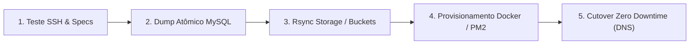

# ☁️ Documento 08: Migração Multi-Cloud Zero Downtime & Cloudflare Tunnels

> **DOCUMENTAÇÃO OFICIAL DO CLOUDOPS HUB**  
> Guia operacional para migração automatizada entre provedores de nuvem e roteamento de tráfego seguro.

---

## 1. Visão Geral da Migração Multi-Cloud

O módulo de **Migração Multi-Cloud** do CloudOps Hub permite transferir a infraestrutura completa de um ou mais projetos da **Oracle Cloud Infrastructure (OCI)** para qualquer outro provedor de VPS (como **Hostinger**, **Hetzner**, **AWS EC2**, **DigitalOcean**, **Contabo** ou **Bare-Metal**) sem derrubar clientes ou interromper requisições.

### Principais Características:
* **Zero Downtime:** A aplicação de origem continua respondendo normalmente enquanto os dados são sincronizados no destino.
* **1-Clique Automatizado:** Execução através de pipeline com 5 etapas orquestradas via SSH.
* **Multi-Projetos Suportados:**
  * **Boteco do Sivirino:** Banco MySQL 8.0 (12 categorias, 134 pratos), Bucket OCI de fotos, Backend Docker (Porta 3002).
  * **Lottus API:** Aplicação Node.js corporativa em PM2 (Porta 3001, ~15MB RAM).
  * **Plataforma Inglês:** Microsserviço de idiomas Docker (Porta 3003).
  * **Todos os Projetos:** Migração consolidada de toda a VM em uma única operação.
* **Provedor Livre:** O campo de destino aceita qualquer provedor VPS via digitação livre ou seleção sugerida.

---

## 2. Pipeline de Migração em 5 Fases

### Detalhamento das Fases:
1. **Fase 1 — Validação e Pré-voo:**
   * Conecta na nova VPS via SSH (`ssh2` em porta configurável, chave privada ou senha).
   * Inspeciona RAM, CPU, disco e portas abertas para garantir compatibilidade.
2. **Fase 2 — Snapshot Atômico do Banco de Dados:**
   * Executa `mysqldump --single-transaction --quick` no container `boteco_db` sem bloquear leituras.
   * Compacta o dump com `gzip` para transferência de alta velocidade.
3. **Fase 3 — Sincronização de Storage e Imagens:**
   * Sincroniza arquivos estáticos e uploads de fotos via `rsync -avz` criptografado.
4. **Fase 4 — Auto-Provisionamento na VPS de Destino:**
   * Instala Docker, Docker Compose, Node.js e PM2 caso não estejam presentes.
   * Clona ou transfere as variáveis de ambiente `.env` e arquivos `docker-compose.yml`.
   * Restaura o banco de dados e sobe os containers e serviços PM2.
5. **Fase 5 — Virada de Chave (Cutover) & Teste de Integridade:**
   * Testa a saúde dos endpoints com `curl -f http://localhost:<porta>/health`.
   * Atualiza a rota do túnel Cloudflare ou IP público no DNS para direcionar o tráfego em tempo real.

---

## 3. Infraestrutura como Código (IaC): Terraform e Bash

O CloudOps Hub disponibiliza a exportação dos scripts de automação:
* **Terraform (`main.tf`):** Define os recursos de computação, rede e regras de firewall para AWS, Hetzner, DigitalOcean ou OCI.
* **Script Bash Autônomo (`migrate.sh`):** Permite executar a migração via linha de comando em servidores remotos sem depender do navegador.

---

## 4. Cloudflare Tunnels (Zero Trust)

O túnel Anycast da Cloudflare garante que nenhuma porta da VM (como 3001, 3002 ou 3306) precise ficar exposta na internet pública:
* **Comunicação Segura:** O daemon `cloudflared` conecta por túnel de saída TLS aos servidores da Cloudflare.
* **Domínio Oficial:** `cardapio.botecosivirino.com.br` roteado diretamente para a porta 3002 local.
* **Ações Rápidas no Hub:**
  * Reiniciar túnel
  * Regenerar URL pública temporária
  * Mapear novos subdomínios para portas internas
