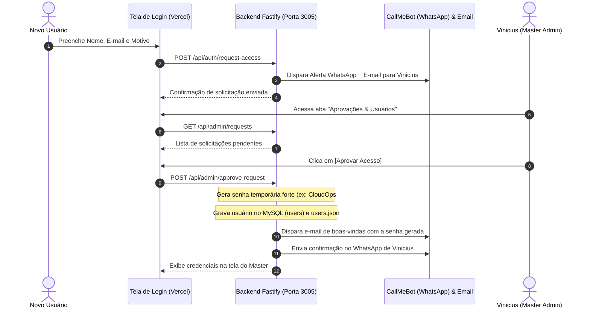

# 🛡️ Documento 10: Autenticação Master, Multi-Tenancy & Persistência AES-256

Este documento descreve a arquitetura de segurança, autenticação e isolamento multi-tenant do **CloudOps Hub**.

---

## 1. Visão Geral da Autenticação

O CloudOps Hub adota um modelo híbrido com controle de acesso baseado em funções (RBAC) e proteção Zero Trust:

1. **Conta Master (Super Administrador)**:
   - **Identidade:** `Vinicius Lourenco (Master)`
   - **E-mail:** `vviniciuslourenco@gmail.com`
   - **Privilégios:** Visão total de todos os nós do cluster (`instance-bytedata`, `cloudops-micro-02`), Oracle Autonomous Database (ATP), gestão de túneis Cloudflare, ciclo de vida dos containers Docker, aprovação de solicitações de novos usuários e execução de backups.
   - **Proteção:** Senha com hash bcrypt (10 rounds) e emissão de token JWT assinado válido por 7 dias.

2. **Contas de Clientes / Tenants (Multi-Tenancy Isolado)**:
   - Quando um novo usuário solicita acesso e é aprovado, ele acessa um **workspace isolado e limpo** (0 servidores ativos).
   - O usuário não enxerga as VMs produtivas do Master (`instance-bytedata`, `cloudops-micro-02`).
   - Um card intuitivo de boas-vindas orienta o usuário a conectar sua própria VPS ou VM (`+ Conectar Minha Primeira VM / VPS (SSH)`).

---

## 2. Fluxo de Solicitação e Aprovação de Acesso



---

## 3. Persistência de Servidores com Criptografia AES-256-GCM

Quando qualquer usuário adiciona uma nova máquina virtual ou VPS ao CloudOps Hub:

1. **Criptografia na Origem**: A chave privada SSH nunca é gravada em texto plano.
2. **Algoritmo**: `AES-256-GCM` com vetor de inicialização (IV) de 16 bytes aleatórios por registro e tag de autenticação para evitar adulteração (tamper-proofing).
3. **Chave Mestra**: Derivada de `process.env.MASTER_KEY` no ambiente seguro da VM.
4. **Isolamento no Banco de Dados (`user_servers`)**:
   ```sql
   CREATE TABLE user_servers (
     id VARCHAR(36) PRIMARY KEY,
     user_id VARCHAR(36) NOT NULL,
     name VARCHAR(100) NOT NULL,
     ip VARCHAR(45) NOT NULL,
     port INT DEFAULT 22,
     user VARCHAR(50) DEFAULT 'ubuntu',
     provider VARCHAR(100) DEFAULT 'VPS',
     encrypted_key TEXT NOT NULL,
     iv VARCHAR(64) NOT NULL,
     tag VARCHAR(64) NOT NULL,
     created_at TIMESTAMP DEFAULT CURRENT_TIMESTAMP
   );
   ```
5. **Endpoints Seguros**:
   - `GET /api/user/servers`: Lista apenas servidores do usuário autenticado (omite a chave).
   - `POST /api/user/servers`: Criptografa e salva o novo nó.
   - `DELETE /api/user/servers/:id`: Remove o vínculo do servidor.

---

## 4. Endpoints de Autenticação e Gestão de Usuários

| Método | Endpoint | Proteção | Descrição |
| :--- | :--- | :--- | :--- |
| `POST` | `/api/auth/login` | Público | Autentica usuário e retorna JWT de 7 dias |
| `GET` | `/api/auth/me` | Bearer JWT | Retorna dados e permissões da sessão ativa |
| `POST` | `/api/auth/request-access` | Público | Envia pedido de acesso com alerta instantâneo |
| `GET` | `/api/admin/requests` | Master Only | Lista todas as solicitações pendentes e aprovadas |
| `POST` | `/api/admin/approve-request` | Master Only | Aprova acesso, gera senha e dispara credenciais |
| `POST` | `/api/admin/reject-request` | Master Only | Rejeita solicitação de acesso |
| `GET` | `/api/admin/users` | Master Only | Lista usuários ativos e datas de cadastro |
